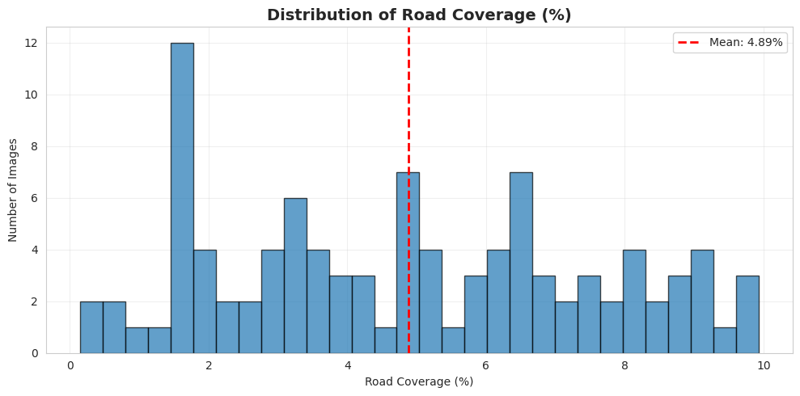
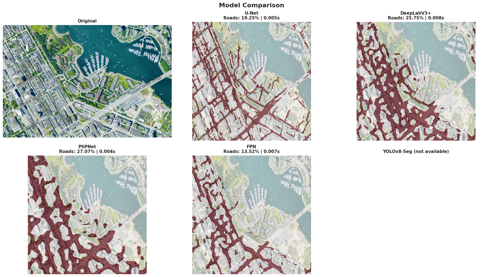
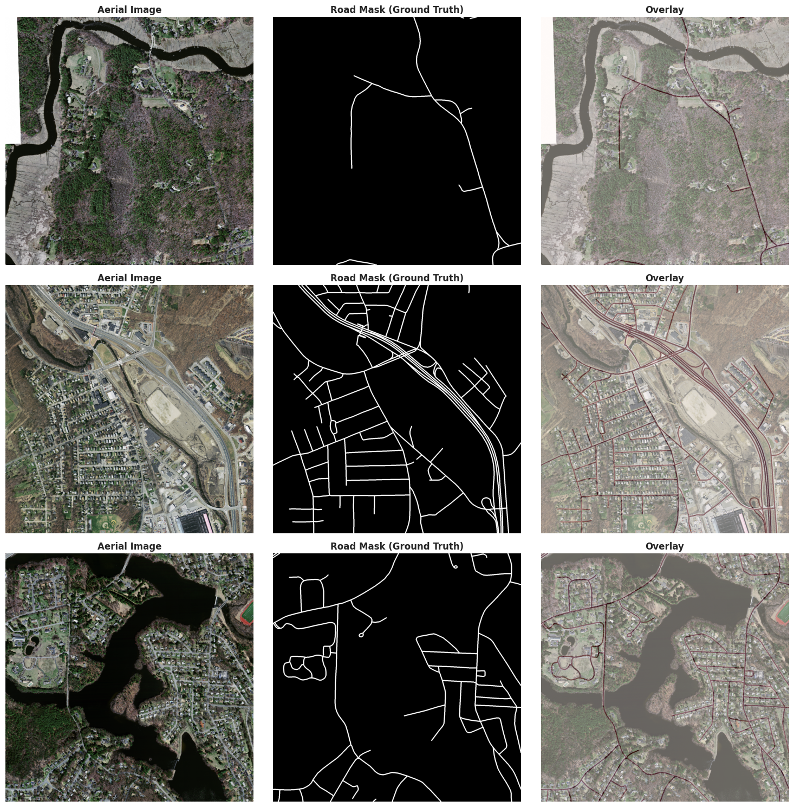
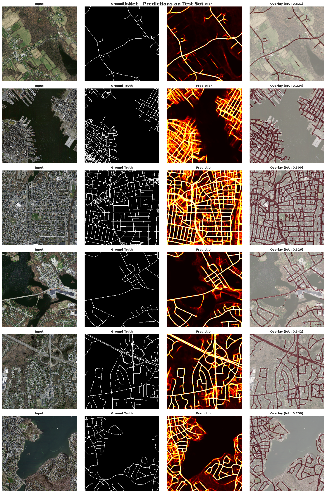
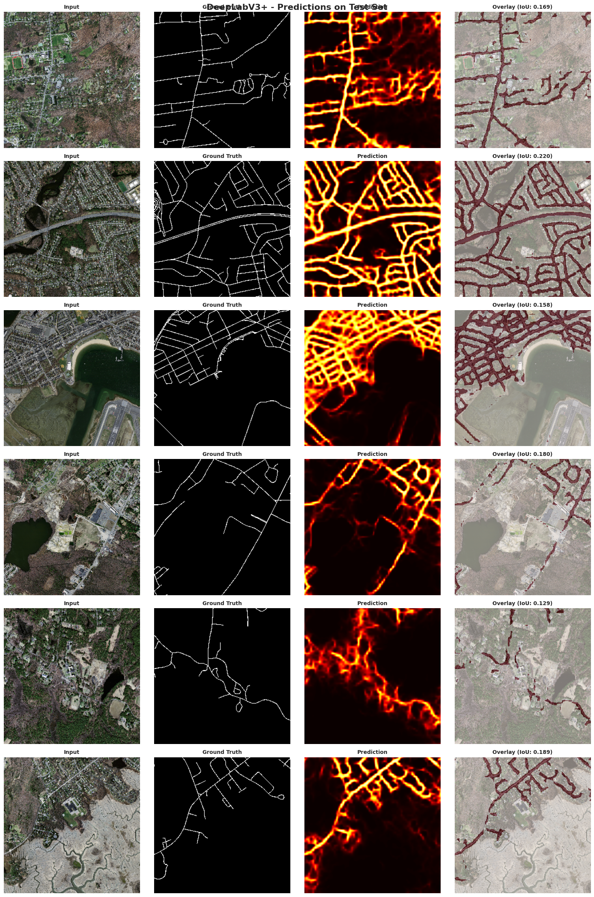

# Deep Learning Road Network Extraction

Semantic segmentation project for extracting road networks from high-resolution aerial imagery. The work compares U-Net, DeepLabV3+, PSPNet, and FPN on the Massachusetts Roads Dataset and evaluates how well each model preserves thin, fragmented road structures under severe class imbalance.

## Project Artifacts

| Artifact | Link |
| --- | --- |
| Final report | [reports/final-report.pdf](reports/final-report.pdf) |
| Presentation deck | [reports/final-presentation.pdf](reports/final-presentation.pdf) |
| Colab notebook export | [reports/colab-notebook-export.pdf](reports/colab-notebook-export.pdf) |
| Dataset notes | [data/README.md](data/README.md) |

The local project folder also contains a 202 MB demo video (`AML FINAL.mp4`). It is intentionally excluded from GitHub because it exceeds the normal GitHub file-size limit.

## Problem Context

Manual road digitization is slow, expensive, and difficult to scale across large aerial imagery collections. Automated road extraction supports GIS mapping, urban planning, emergency response, transportation analysis, autonomous navigation datasets, and geospatial intelligence workflows.

Road segmentation is challenging because road pixels represent only a small fraction of each image, roads are thin and topology-sensitive, and aerial scenes include shadows, trees, occlusions, variable road widths, and complex rural or urban backgrounds.

## Dataset

- Source: [Massachusetts Roads Dataset on Kaggle](https://www.kaggle.com/datasets/balraj98/massachusetts-roads-dataset)
- Task: binary semantic segmentation of road pixels from aerial imagery
- Size: approximately 1,171 image-mask pairs
- Original imagery: high-resolution TIFF images around 1500 x 1500 pixels
- Road coverage: approximately 4.89% of pixels, creating strong class imbalance



## Methodology

The workflow used a shared preprocessing and training setup so the model comparison stayed fair:

- Resize/tile imagery into 256 x 256 training patches
- Apply augmentation including flips, rotations, brightness shifts, and noise
- Train segmentation models with combined BCE and Dice-style objectives
- Evaluate with IoU, F1-score, precision, recall, qualitative prediction quality, and inference speed
- Compare road continuity, missed narrow roads, false positives, and fragmentation

## Models Compared

- U-Net
- DeepLabV3+
- PSPNet
- Feature Pyramid Network (FPN)

The Colab notebook export also includes a live prediction interface for uploading an aerial image and comparing model outputs.

## Results Summary

U-Net produced the strongest result in this experiment, with reported IoU of 0.2954, F1-score of 0.4556, and approximately 1548.96 FPS inference. The report attributes this advantage to U-Net's encoder-decoder structure and skip connections, which help preserve fine spatial detail for thin roads.

Deeper and multi-scale architectures such as DeepLabV3+, PSPNet, and FPN detected larger roads but produced more fragmented outputs on narrow or occluded road segments in this training setup.



## Qualitative Outputs

### Training Samples



### U-Net Predictions



### DeepLabV3+ Predictions



## Training Completion Snapshots

| Model | Snapshot |
| --- | --- |
| U-Net | [assets/figures/unet-training-complete.png](assets/figures/unet-training-complete.png) |
| DeepLabV3+ | [assets/figures/deeplabv3plus-training-complete.png](assets/figures/deeplabv3plus-training-complete.png) |
| PSPNet | [assets/figures/pspnet-training-complete.png](assets/figures/pspnet-training-complete.png) |
| FPN | [assets/figures/fpn-training-complete.png](assets/figures/fpn-training-complete.png) |

## Tools

Python, PyTorch, segmentation-models-pytorch, Albumentations, OpenCV, NumPy, pandas, Matplotlib, Seaborn, Kaggle API, semantic segmentation, remote sensing, and GIS analysis.

## Repository Structure

```text
.
|-- README.md
|-- assets/
|   `-- figures/
|       |-- deeplabv3plus-test-predictions.png
|       |-- deeplabv3plus-training-complete.png
|       |-- fpn-training-complete.png
|       |-- model-comparison.png
|       |-- pspnet-training-complete.png
|       |-- road-coverage-distribution.png
|       |-- training-samples.png
|       |-- unet-test-predictions.png
|       `-- unet-training-complete.png
|-- data/
|   `-- README.md
`-- reports/
    |-- colab-notebook-export.pdf
    |-- final-presentation.pdf
    `-- final-report.pdf
```

## Author

Sairam Jammu  
M.S. Business Analytics, Kent State University
